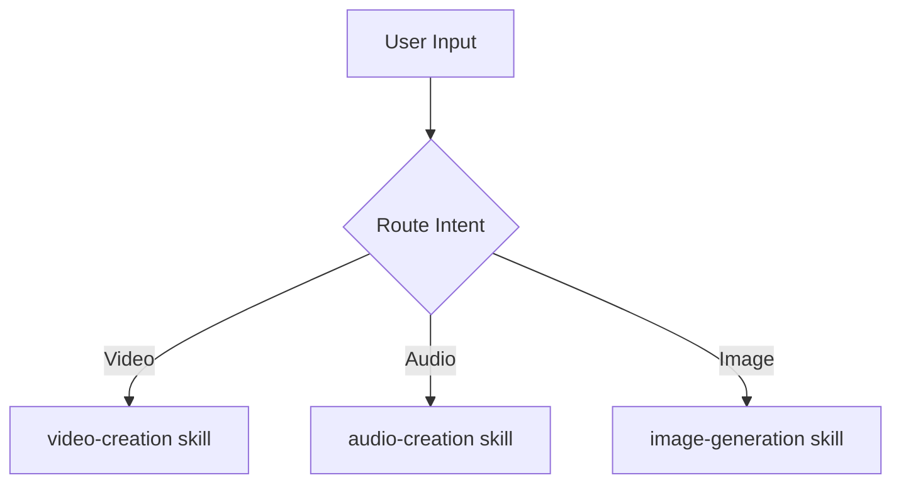

# Super Cláudio Implementation Plan

> **For agentic workers:** REQUIRED SUB-SKILL: Use superpowers:subagent-driven-development (recommended) or superpowers:executing-plans to implement this plan task-by-task. Steps use checkbox (`- [ ]`) syntax for tracking.

**Goal:** Build `super-claudio`, a Claude Code plugin with 8 curated skills covering video creation, audio generation, image generation, marketing/ads, design, free APIs, and skill discovery — so Claude always knows the best tools for any creative or technical task.

**Architecture:** A plugin with category-level routing skills (each with a broad trigger description) that load a routing body and progressively disclose sub-domain reference files. A `discover` fallback skill searches community marketplaces when no curated skill covers the user's need. Skills use the hybrid routing pattern: description-level category selection + body-level sub-domain routing + reference-level deep knowledge.

**Tech Stack:** Claude Code plugin format (`.claude-plugin/plugin.json`), SKILL.md files with YAML frontmatter, Markdown reference files.

---

## File Map

```
super-claudio/
├── .claude-plugin/
│   └── plugin.json
├── skills/
│   ├── video-creation/
│   │   ├── SKILL.md
│   │   └── references/
│   │       ├── realistic.md       # Hailuo/Higssfield, Kling, Seedance, Google Veo
│   │       ├── programmatic.md    # Remotion (React-based video)
│   │       ├── ads.md             # Nano Banana, Weavy AI, aicreator.co, TikTok Shop
│   │       └── editing.md         # ffmpeg, remove silence, trim, captions
│   ├── audio-creation/
│   │   ├── SKILL.md
│   │   └── references/
│   │       ├── tts.md             # Azure Neural TTS, ElevenLabs (multilingual)
│   │       └── music.md           # Suno, Udio, background music
│   ├── image-generation/
│   │   ├── SKILL.md
│   │   └── references/
│   │       ├── realistic.md       # Midjourney, DALL-E 3, Stable Diffusion, Flux
│   │       ├── graphics.md        # Napkin.ai (diagrams/visuals from text)
│   │       └── motion.md          # Weavy AI (animate static images)
│   ├── marketing-and-ads/
│   │   ├── SKILL.md
│   │   └── references/
│   │       ├── video-ads.md       # Higssfield, Kling for product ads
│   │       ├── image-ads.md       # Canva API, Nano Banana, stock sources
│   │       └── ecommerce.md       # TikTok Shop, Instagram Shop workflows
│   ├── design-and-ui/
│   │   ├── SKILL.md
│   │   └── references/
│   │       ├── inspiration.md     # getdesign.md, Dribbble, Mobbin
│   │       └── tools.md           # Napkin.ai for diagrams, Excalidraw, v0.dev
│   ├── free-apis/
│   │   ├── SKILL.md
│   │   └── references/
│   │       ├── geo-weather.md     # NASA EONET, OpenWeatherMap, Open-Meteo
│   │       └── catalog.md         # Curated list of other notable free APIs
│   └── discover/
│       ├── SKILL.md
│       └── references/
│           └── marketplaces.md    # Sources: claudemarketplaces.com, aitmpl.com, awesomeclaude.ai
└── docs/
    └── superpowers/
        └── plans/
            └── 2026-05-02-super-claudio.md  ← this file
```

---

## Task 1: Plugin Scaffolding

**Files:**
- Create: `.claude-plugin/plugin.json`
- Create: `skills/` (directory structure)

- [ ] **Step 1: Create the `.claude-plugin` directory and `plugin.json`**

```bash
mkdir -p .claude-plugin
```

Content of `.claude-plugin/plugin.json`:
```json
{
  "name": "super-claudio",
  "description": "Super Cláudio — curated skills for anything Claude can do: video creation, audio generation, image generation, marketing/ads, UI design, free APIs, and community skill discovery.",
  "author": {
    "name": "Caio Roscelly",
    "email": "caioroscelly@gmail.com"
  }
}
```

- [ ] **Step 2: Create all skill directory stubs**

```bash
mkdir -p skills/video-creation/references
mkdir -p skills/audio-creation/references
mkdir -p skills/image-generation/references
mkdir -p skills/marketing-and-ads/references
mkdir -p skills/design-and-ui/references
mkdir -p skills/free-apis/references
mkdir -p skills/discover/references
```

- [ ] **Step 3: Verify structure**

```bash
find skills -type d
```

Expected output:
```
skills/video-creation
skills/video-creation/references
skills/audio-creation
skills/audio-creation/references
skills/image-generation
skills/image-generation/references
skills/marketing-and-ads
skills/marketing-and-ads/references
skills/design-and-ui
skills/design-and-ui/references
skills/free-apis
skills/free-apis/references
skills/discover
skills/discover/references
```

- [ ] **Step 4: Commit**

```bash
git add .claude-plugin/ skills/
git commit -m "feat: scaffold super-claudio plugin structure"
```

---

## Task 2: video-creation skill

**Files:**
- Create: `skills/video-creation/SKILL.md`
- Create: `skills/video-creation/references/realistic.md`
- Create: `skills/video-creation/references/programmatic.md`
- Create: `skills/video-creation/references/ads.md`
- Create: `skills/video-creation/references/editing.md`

- [ ] **Step 1: Write `skills/video-creation/SKILL.md`**

```markdown
---
name: video-creation
description: >
  Video creation skill. Use when the user wants to create, generate, or produce any kind of video.
  Trigger on prompts like: "I want to make a video", "create a video for TikTok", "generate a
  realistic video of my product", "make a promo video", "animate my photo", "create a video ad",
  "I want to share a video on WhatsApp", "make a short for Instagram", "create content for Reels",
  "generate a video from my image", "make a product demo video".
  Also trigger when the user mentions: Remotion, Higssfield, Hailuo, Kling, Seedance, Weavy AI,
  aicreator.co, ElevenLabs video, or any video generation tool by name.
  Do NOT trigger for: audio-only requests, image generation (no animation), or video editing of
  existing footage (use video-editing skill instead).
---

# Video Creation

You have deep knowledge of the best tools for creating videos in any style. Your job is to
understand what the user actually wants and route them to the right workflow.

## Understand the goal first

Before recommending tools, ask yourself:
- **Realistic or stylized?** (AI-generated cinematic vs. animated/motion-graphic)
- **From text, image, or code?** (text prompt → video, static image → video, code → video)
- **Purpose?** (social media ad, WhatsApp share, product demo, personal content)
- **Platform?** (TikTok 9:16, Instagram Reels, YouTube, WhatsApp)

If the user's prompt is ambiguous, ask one clarifying question.

## Routing

Based on the user's intent, read the relevant reference file:

| Intent | Reference file |
|--------|---------------|
| Realistic AI video (cinematic, product, human motion) | `references/realistic.md` |
| Programmatic / animated / emoji / code-based video | `references/programmatic.md` |
| Video for ads, TikTok Shop, Instagram Shop, ecommerce | `references/ads.md` |
| Editing existing video (trim, silence removal, captions) | `references/editing.md` |

Read the matching reference file and follow its workflow.

## When to check for more tools

If none of these fit the user's need perfectly, invoke the `super-claudio:discover` skill to
search community marketplaces for newer or more specialized video tools.
```

- [ ] **Step 2: Write `skills/video-creation/references/realistic.md`**

```markdown
# Realistic AI Video Generation

Tools that generate photorealistic or cinematic video from text prompts or images.

## Tool Comparison

| Tool | Input | Best For | Free Tier | URL |
|------|-------|----------|-----------|-----|
| **Hailuo AI** (Higssfield) | Text / Image | Cinematic, human motion, product | Limited free | hailuoai.video |
| **Kling 2.x** (Kuaishou) | Text / Image | Long clips (up to 2 min), high quality | Limited free | klingai.com |
| **Seedance** (ByteDance) | Text / Image | Fast generation, social content | Limited free | — |
| **Google Veo 2** | Text / Image | High quality, Google ecosystem | Via AI Studio | aistudio.google.com |
| **Runway Gen-3** | Text / Image / Video | Professional, fine control | Limited free | runwayml.com |

## Recommended Workflow (Hailuo / Kling)

1. Prepare a reference image if possible — results are significantly better than text-only.
2. Write a descriptive prompt: subject + action + environment + camera movement + style.
   - Good: "A woman in a red dress walks through a rainy Tokyo street at night, cinematic lighting, slow motion, shallow depth of field"
   - Bad: "woman walking"
3. Set aspect ratio to match target platform (9:16 for TikTok/Reels, 16:9 for YouTube).
4. Generate 2-3 variants and pick the best.
5. Download and use directly or pass to an editing tool.

## Prompt Tips for Realism

- Always include lighting description (golden hour, studio lighting, neon reflections)
- Specify camera movement (dolly in, tracking shot, static, handheld)
- Add "photorealistic", "8K", "cinematic" for quality
- For product videos: white/studio background → cleaner results

## Google AI Studio (Veo 2) — Free Access

1. Go to aistudio.google.com
2. Create a new prompt → select "Video" model (Veo 2)
3. Enter text prompt → generate
4. Free tier available with Google account; high quality results

## Notes

- All tools have usage limits on free tiers; paid plans give more credits
- Kling has the longest clip duration (up to 2 minutes)
- Hailuo/Higssfield tends to produce the most cinematic human motion
- For product ads specifically, see `ads.md`
```

- [ ] **Step 3: Write `skills/video-creation/references/programmatic.md`**

```markdown
# Programmatic / Code-Based Video

Create videos through code rather than AI generation. Best for: animated infographics, text-heavy
content, emoji videos, presentations, and branded templates you can reuse.

## Remotion — React-Based Video

Remotion lets you create videos using React components. Every frame is a React render.

**Install:**
```bash
npx create-video@latest
# choose a template: Hello World, Blank, or from remotion.dev/templates
```

**Templates worth knowing:**
- `remotion.dev/templates` — starter templates including social media formats
- Emoji/motion graphics templates — great for fun WhatsApp/Instagram shares
- Data visualization templates — animate charts and stats

**Basic structure:**
```tsx
import { AbsoluteFill, useCurrentFrame, interpolate } from 'remotion';

export const MyVideo = () => {
  const frame = useCurrentFrame();
  const opacity = interpolate(frame, [0, 30], [0, 1]);
  return (
    <AbsoluteFill style={{ backgroundColor: 'white', opacity }}>
      <h1>Hello!</h1>
    </AbsoluteFill>
  );
};
```

**Render to file:**
```bash
npx remotion render src/index.ts MyVideo out/video.mp4
```

**Best for:**
- Shareable WhatsApp/Instagram content with text + emoji
- Branded promotional videos with consistent style
- Animated data/infographic content
- Anything you want to generate programmatically (bulk, templated)

## When to use Remotion vs AI video

| Use Remotion | Use AI video (Kling/Hailuo) |
|---|---|
| Text-heavy content | Realistic human/scene motion |
| Reusable template | One-off creative content |
| Data visualization | Cinematic aesthetics |
| Full code control | Natural-looking footage |
| No usage credits needed | Fast non-code workflow |
```

- [ ] **Step 4: Write `skills/video-creation/references/ads.md`**

```markdown
# Video Creation for Ads & Social Commerce

Workflows for creating video content for TikTok Shop, Instagram Shop, Facebook Ads, and
other performance marketing channels.

## Tool Stack for Realistic Product Ads

### Step 1: Generate product image
- Use image generation tools (see image-generation skill) or photograph your product
- Clean white/studio background works best for product isolation

### Step 2: Animate the image (add motion)
- **Weavy AI** — takes a static image and adds realistic motion (person walks, model poses, fabric moves)
  - Great for: fashion, lifestyle products, showing a model wearing/using your product
  - URL: weavy.ai (verify current URL)
- **Kling "Image to Video"** — similar approach, strong motion quality
  - URL: klingai.com → Image to Video

### Step 3: Add audio/voiceover (optional)
- See `audio-creation` skill for TTS options (ElevenLabs, Azure Neural TTS)
- Add background music from royalty-free sources (Pixabay Music, Free Music Archive)

### Step 4: Final edit
- Add captions, product name overlay, CTA ("Shop Now", "Link in Bio")
- Use CapCut (free, mobile/desktop) for quick edits and caption overlay
- Or use the `video-editing` reference for ffmpeg-based automation

## aicreator.co — All-in-One Ad Video

aicreator.co generates complete ad videos for Instagram, TikTok, or general ads from a prompt.
- Input: product description / product image
- Output: short-form video with music, captions, CTA
- Good for: fast iteration, testing creatives at scale

## Nano Banana 2 — Image for Ads

Tool for generating ad-optimized product images:
- Creates lifestyle/context images of products
- Input: product image + scene description
- Output: product placed in realistic scene (kitchen, lifestyle, etc.)
- Then: pass to Weavy AI or Kling to animate

## TikTok Shop Workflow

1. Create product image (real photo or Nano Banana 2 scene)
2. Animate with Weavy AI (model interacts with product)
3. Add music + captions (CapCut or ffmpeg)
4. Upload to TikTok with Shop product tag
5. Add affiliate/shop link in description

## Platform Specs

| Platform | Aspect Ratio | Duration | File |
|---|---|---|---|
| TikTok | 9:16 | 15-60s optimal | MP4 |
| Instagram Reels | 9:16 | Up to 90s | MP4 |
| Facebook Ads | 1:1 or 9:16 | 15-30s optimal | MP4 |
| YouTube Shorts | 9:16 | Up to 60s | MP4 |
| WhatsApp | Any | Up to 90s | MP4 |
```

- [ ] **Step 5: Write `skills/video-creation/references/editing.md`**

```markdown
# Video Editing

Tools and workflows for editing existing video: trimming, silence removal, captions, format conversion.

## ffmpeg — The Universal Tool

ffmpeg is free, runs locally, handles virtually any video editing task.

**Install:**
```bash
brew install ffmpeg          # macOS
sudo apt install ffmpeg      # Ubuntu/Debian
```

**Common operations:**

Trim a clip (start at 0:30, duration 60 seconds):
```bash
ffmpeg -i input.mp4 -ss 00:00:30 -t 00:01:00 -c copy output.mp4
```

Convert format (mp4 → webm):
```bash
ffmpeg -i input.mp4 output.webm
```

Resize to 9:16 (TikTok/Reels):
```bash
ffmpeg -i input.mp4 -vf "scale=1080:1920,setsar=1" output_9x16.mp4
```

Compress for WhatsApp (reduce file size):
```bash
ffmpeg -i input.mp4 -vcodec libx264 -crf 28 -preset fast output_compressed.mp4
```

## Silence Removal

Use `auto-editor` — detects and removes silent sections automatically:

```bash
pip install auto-editor
auto-editor input.mp4 --margin 0.2sec
```

This removes pauses/silence and exports a tighter cut. Great for talking-head videos and tutorials.

## Auto Captions

**Whisper (OpenAI) — local, free:**
```bash
pip install openai-whisper
whisper input.mp4 --model medium --output_format srt
```

Then burn captions into video:
```bash
ffmpeg -i input.mp4 -vf "subtitles=input.srt" output_captioned.mp4
```

**CapCut** — free desktop app, automatic captions with one click, good for social media.

## video-use Skill

If the `video-use` skill is installed, it provides a higher-level interface for common editing
operations. Invoke it for complex editing workflows that involve multiple steps.
```

- [ ] **Step 6: Commit**

```bash
git add skills/video-creation/
git commit -m "feat: add video-creation routing skill with 4 reference workflows"
```

---

## Task 3: audio-creation skill

**Files:**
- Create: `skills/audio-creation/SKILL.md`
- Create: `skills/audio-creation/references/tts.md`
- Create: `skills/audio-creation/references/music.md`

- [ ] **Step 1: Write `skills/audio-creation/SKILL.md`**

```markdown
---
name: audio-creation
description: >
  Audio creation and generation skill. Use when the user wants to generate speech, voiceover,
  narration, podcast audio, or background music from text or prompts.
  Trigger on: "read this article aloud", "summarize this as audio", "create a voiceover",
  "generate narration in Portuguese", "make a 1-minute audio summary", "text to speech",
  "TTS", "create background music", "generate a jingle", "audio in Spanish/Portuguese/English".
  Also trigger when the user mentions: ElevenLabs, Azure TTS, Francisca Neural, Suno, Udio,
  or any audio generation tool by name.
  Do NOT trigger for: video creation (use video-creation skill), audio editing of existing files.
---

# Audio Creation

You know the best tools for generating speech, narration, and music from text. Route based on intent:

## Routing

| Intent | Reference file |
|--------|---------------|
| Text-to-speech, voiceover, narration, article summary as audio | `references/tts.md` |
| Background music, jingles, instrumental tracks | `references/music.md` |

Read the matching reference file and follow its workflow.

## Quick tip on multilingual TTS

Azure Neural TTS and ElevenLabs both support Portuguese (Brazil), Spanish, English, and 100+
languages with high-quality natural voices. For a quick 1-minute audio summary of an article,
Azure Neural TTS is free and excellent.
```

- [ ] **Step 2: Write `skills/audio-creation/references/tts.md`**

```markdown
# Text-to-Speech & Voiceover Generation

## Azure Neural TTS — Free, High Quality, Multilingual

Microsoft Azure Neural TTS produces natural-sounding speech with no cost for moderate usage.

**Use directly from terminal (no API key needed for basic use via edge-tts):**

```bash
pip install edge-tts
```

Generate audio in Portuguese (Francisca Neural — the voice Caio uses):
```bash
edge-tts --voice pt-BR-FranciscaNeural --text "Seu texto aqui" --write-media output.mp3
```

Generate in English:
```bash
edge-tts --voice en-US-JennyNeural --text "Your text here" --write-media output.mp3
```

Generate in Spanish:
```bash
edge-tts --voice es-ES-ElviraNeural --text "Tu texto aquí" --write-media output.mp3
```

**List all available voices:**
```bash
edge-tts --list-voices
```

**Summarize an article as audio (example workflow):**
1. Fetch article text (use WebFetch tool)
2. Summarize to ~200 words using Claude
3. Generate audio: `edge-tts --voice pt-BR-FranciscaNeural --text "..." --write-media summary.mp3`
4. Play or share: `afplay summary.mp3` (macOS) or `mpg123 summary.mp3` (Linux)

## ElevenLabs — Premium Quality, Voice Cloning

ElevenLabs produces studio-quality speech and supports voice cloning.

**API usage:**
```python
from elevenlabs.client import ElevenLabs

client = ElevenLabs(api_key="your-key")
audio = client.generate(
    text="Hello! This is a test.",
    voice="Rachel",
    model="eleven_multilingual_v2"
)
with open("output.mp3", "wb") as f:
    f.write(audio)
```

**Free tier:** 10,000 characters/month
**Best for:** High-quality voiceovers for ads or professional content
**Voice cloning:** Paid feature; clone any voice from a sample

## Choosing Between Tools

| Need | Tool |
|------|------|
| Quick article summary, personal use | edge-tts (Azure, free) |
| Professional ad voiceover | ElevenLabs |
| Portuguese/Spanish natural voice | edge-tts Francisca / ElevenLabs multilingual |
| Voice cloning | ElevenLabs (paid) |
| Bulk generation (many files) | edge-tts (no credit limits) |
```

- [ ] **Step 3: Write `skills/audio-creation/references/music.md`**

```markdown
# AI Music & Background Audio Generation

## Suno — Text-to-Music

Generate complete songs (vocals + instruments) from a text prompt.

- URL: suno.com
- Free tier: ~50 songs/day
- Input: genre, mood, lyrics (optional), style description
- Output: full song MP3

Example prompt: "upbeat Brazilian funk, energetic, no lyrics, good for TikTok ads"

## Udio — High-Quality Music Generation

Similar to Suno, strong on musicality and production quality.

- URL: udio.com
- Free tier available
- Good for: background music for videos, ads, presentations

## Free Royalty-Free Music (no generation needed)

For background music without AI generation:
- **Pixabay Music** — pixabay.com/music — free, no attribution required
- **Free Music Archive** — freemusicarchive.org
- **YouTube Audio Library** — studio.youtube.com/channel/music
- **ccMixter** — ccmixter.org — Creative Commons licensed

## When to Use AI vs. Library

| Use AI music (Suno/Udio) | Use library |
|---|---|
| Need specific mood/genre | Need something quickly |
| No matching library track | Any genre fits |
| Unique branded sound | Speed matters |
```

- [ ] **Step 4: Commit**

```bash
git add skills/audio-creation/
git commit -m "feat: add audio-creation skill with TTS and music references"
```

---

## Task 4: image-generation skill

**Files:**
- Create: `skills/image-generation/SKILL.md`
- Create: `skills/image-generation/references/realistic.md`
- Create: `skills/image-generation/references/graphics.md`
- Create: `skills/image-generation/references/motion.md`

- [ ] **Step 1: Write `skills/image-generation/SKILL.md`**

```markdown
---
name: image-generation
description: >
  Image generation skill. Use when the user wants to create, generate, or design any kind of image,
  graphic, diagram, chart, or visual — using AI tools or prompt-based generation.
  Trigger on: "generate an image", "create a graphic", "make a diagram", "visualize this concept",
  "create a product photo", "generate an illustration", "make a flowchart from this text",
  "create a visual", "draw X", "generate a photo of Y", "make an infographic".
  Also trigger for: Midjourney, DALL-E, Stable Diffusion, Flux, Napkin.ai, Nano Banana,
  or any image generation tool mentioned by name.
  Do NOT trigger for: video (use video-creation), audio (use audio-creation), code/UI screenshots.
---

# Image Generation

You know the best tools for generating images in any style. Route based on intent:

## Routing

| Intent | Reference file |
|--------|---------------|
| Realistic photos, product images, people, scenes | `references/realistic.md` |
| Diagrams, flowcharts, infographics, data visuals, conceptual graphics | `references/graphics.md` |
| Animating a static image (adding motion) | `references/motion.md` |

Read the matching reference and follow its workflow. If the intent is unclear, ask:
"Do you want a realistic photo, a diagram/graphic, or an animated image?"
```

- [ ] **Step 2: Write `skills/image-generation/references/realistic.md`**

```markdown
# Realistic & Artistic Image Generation

## Tool Comparison

| Tool | Access | Best For | Free |
|------|--------|----------|------|
| **DALL-E 3** | ChatGPT / API | Accurate prompt following, text in images | Limited (ChatGPT Plus) |
| **Flux** (Black Forest Labs) | Replicate, fal.ai | Photorealistic, fast | API credits |
| **Stable Diffusion** | Local / Automatic1111 | Full control, local, free | Yes (local) |
| **Adobe Firefly** | firefly.adobe.com | Commercial safe, style control | Free tier |
| **Ideogram** | ideogram.ai | Text in images, posters | Free tier |
| **Google Imagen** | AI Studio | High quality | Via AI Studio |

## Recommended for Product Images (Ads)

1. **Nano Banana** — generates lifestyle/scene images with your product placed in context
   - Input: product image + scene description ("in a modern kitchen", "on a beach")
   - Output: product in realistic setting, ready for ads
   - Use case: ecommerce product images, ad creatives

2. **Flux via fal.ai** — fast, high quality, API accessible
   ```bash
   # Using fal.ai API
   pip install fal-client
   ```
   ```python
   import fal_client
   result = fal_client.run(
       "fal-ai/flux/schnell",
       arguments={"prompt": "professional product photo, white background, studio lighting"}
   )
   print(result["images"][0]["url"])
   ```

## Prompt Formula for Realistic Images

```
[Subject] + [Action/Pose] + [Environment] + [Lighting] + [Camera] + [Style]
```

Example: "Young Brazilian woman holding a coffee cup, modern São Paulo café interior,
warm afternoon light, portrait lens, photorealistic, 4K"

## Using Claude's Native Image Generation

Claude can generate images directly using its built-in image generation capability.
For quick concept visualization, just ask Claude to generate the image inline.
```

- [ ] **Step 3: Write `skills/image-generation/references/graphics.md`**

```markdown
# Diagrams, Infographics & Data Visuals

## Napkin.ai — Visuals from Text Prompts

Napkin.ai generates clean professional diagrams, flowcharts, and conceptual graphics directly
from text or concept descriptions. No design skills needed.

- URL: napkin.ai
- Input: paste text, describe a concept, or write a prompt
- Output: SVG/PNG diagram, ready to use
- Best for: presentations, documentation, concept visualization, social content
- Free tier: available

**Workflow:**
1. Go to napkin.ai
2. Paste your text or type a description
3. Napkin generates multiple visual interpretations
4. Choose one, customize colors/style, export

**Example prompts:**
- "The lifecycle of a TikTok ad campaign"
- "How neural networks learn"
- "Steps to launch an ecommerce store"

## Mermaid — Code-Based Diagrams

Claude can generate Mermaid diagrams as code, which render in many tools (GitHub, Notion, etc.)



Ask Claude: "Create a Mermaid diagram showing X" — Claude generates the code.
Render it at: mermaid.live

## Excalidraw — Collaborative Whiteboard Diagrams

- URL: excalidraw.com
- Freehand, hand-drawn aesthetic
- Export as SVG or PNG
- Can be embedded in docs/Notion

## Canva — Infographics & Social Graphics

- URL: canva.com
- Free tier very capable
- Templates for Instagram posts, LinkedIn infographics, presentations
- Good for: polish + export in multiple formats
```

- [ ] **Step 4: Write `skills/image-generation/references/motion.md`**

```markdown
# Animating Static Images

Tools that take a still image and add realistic motion to it.

## Weavy AI — Motion from Photo

Adds realistic motion to a static photograph (person moves, fabric flows, hair blows).

- Great for: fashion images, lifestyle photos, product ads where a model wears/uses the product
- Input: photo + motion direction prompt
- Output: short looping or progressive video clip
- Common use case: animate an ecommerce model photo → use in TikTok Shop

**Workflow:**
1. Prepare a clean product/model photo
2. Upload to Weavy AI
3. Describe the desired motion: "model turns and smiles", "dress flows in wind", "product rotates slowly"
4. Generate and download as MP4

## Kling "Image to Video" — High Quality Motion

Kling's image-to-video mode is also excellent for animating photos.

- URL: klingai.com → Image to Video tab
- Higher quality than many tools
- Supports longer clips from a single image

## Runway "Act One" / Gen-3

- URL: runwayml.com
- Professional-grade animation from images
- More control over motion style and duration

## When to Use Which

| Tool | Best For |
|------|---------|
| Weavy AI | Fashion/lifestyle/ecommerce model motion |
| Kling Image-to-Video | General high-quality animation |
| Runway | Professional production, fine control |
```

- [ ] **Step 5: Commit**

```bash
git add skills/image-generation/
git commit -m "feat: add image-generation skill with realistic/graphics/motion references"
```

---

## Task 5: marketing-and-ads skill

**Files:**
- Create: `skills/marketing-and-ads/SKILL.md`
- Create: `skills/marketing-and-ads/references/video-ads.md`
- Create: `skills/marketing-and-ads/references/image-ads.md`
- Create: `skills/marketing-and-ads/references/ecommerce.md`

- [ ] **Step 1: Write `skills/marketing-and-ads/SKILL.md`**

```markdown
---
name: marketing-and-ads
description: >
  Marketing and advertising content creation skill. Use when the user wants to create content
  specifically for ads, campaigns, social commerce, or marketing purposes.
  Trigger on: "create an ad", "make a TikTok ad", "Instagram ad", "Facebook ad", "product promo",
  "ad creative", "marketing content", "ecommerce content", "TikTok Shop", "Instagram Shop",
  "social media campaign", "ad for my product", "promote my product", "sales video",
  "ad banner", "product announcement".
  Also trigger when the user mentions: ad creatives, ROAS, ad spend, campaign assets, product page.
  Do NOT trigger for: general video creation without commercial intent (use video-creation),
  general image creation (use image-generation).
---

# Marketing & Ads Content Creation

You specialize in creating performance-oriented marketing content. Route based on format:

## Routing

| Format | Reference file |
|--------|---------------|
| Video ads (TikTok, Instagram, Facebook, YouTube) | `references/video-ads.md` |
| Image/banner ads (static creatives, carousels) | `references/image-ads.md` |
| Full ecommerce workflow (TikTok Shop, Instagram Shop) | `references/ecommerce.md` |

## What makes a good ad creative

Before routing, check whether the user has these assets ready:
- Product image/video (raw material)
- Target platform (TikTok, Instagram, Facebook, YouTube)
- Target audience (age, interest, geography)
- CTA (call to action): "Shop Now", "Learn More", "Link in Bio"

If missing, ask for the platform and product first — the workflow differs significantly.
```

- [ ] **Step 2: Write `skills/marketing-and-ads/references/video-ads.md`**

```markdown
# Video Ad Creation

## Fast Workflow: Product Video Ad in Under 30 Minutes

### Tools needed
- Product image (real photo or AI-generated)
- Kling or Higssfield (animation)
- CapCut or ffmpeg (captions/CTA overlay)
- ElevenLabs or edge-tts (optional voiceover)

### Steps

1. **Get or create a product image**
   - Real product photo: best quality
   - AI-generated scene: use Nano Banana or Flux (see image-generation skill)

2. **Animate the image**
   - Go to klingai.com → Image to Video
   - Upload image, describe motion: "product slowly rotates on pedestal", "model holds product and smiles at camera"
   - Generate 5-second clip

3. **Add voiceover (optional)**
   ```bash
   edge-tts --voice pt-BR-FranciscaNeural \
     --text "Apresentando o produto X. Qualidade premium, entrega rápida. Compre agora!" \
     --write-media voiceover.mp3
   ```

4. **Merge video + audio + captions**
   ```bash
   # Add voiceover to video
   ffmpeg -i product_clip.mp4 -i voiceover.mp3 \
     -c:v copy -c:a aac -shortest output_with_audio.mp4
   ```
   Or use CapCut: import video + audio, add auto-captions, add text overlay for CTA.

5. **Add CTA overlay**
   In CapCut: Text → "Shop Now" / "Link in Bio" → style to match brand

6. **Export for platform**
   - TikTok/Reels: 1080x1920, MP4, H.264
   - Facebook: 1080x1080 (square) or 9:16

## aicreator.co — Automated Ad Video

For users who want a single-tool solution:
1. Go to aicreator.co
2. Upload product image + describe the product
3. Select target platform (TikTok, Instagram, general)
4. Generate → download complete ad video with music and captions

## Higssfield (Hailuo) for Premium Ads

When you need the highest realism (luxury products, fashion):
1. Prepare a high-quality product/lifestyle image
2. Upload to hailuoai.video
3. Write a detailed prompt describing the camera movement and mood
4. Generate — Higssfield produces cinematic results that feel like professional ad shoots
```

- [ ] **Step 3: Write `skills/marketing-and-ads/references/image-ads.md`**

```markdown
# Image Ad Creatives

## Static Image Ads

### Tools

| Tool | Use | Free |
|------|-----|------|
| **Canva** | Banners, carousels, social posts | Yes (free tier) |
| **Adobe Express** | Quick resizing, brand kits | Free tier |
| **Nano Banana 2** | Product in lifestyle scene | Check site |
| **Flux via fal.ai** | AI-generated product images | API credits |

### Canva Ad Creation Workflow

1. canva.com → Create Design → choose format (Instagram Post, Facebook Ad, etc.)
2. Search templates for "ad" or "product"
3. Replace placeholder image with product photo
4. Edit text: headline, subheadline, CTA button
5. Resize for all platforms in one click (Canva Magic Resize)
6. Export as PNG/JPG

### Prompt for AI-generated ad image (Flux/DALL-E)

```
Professional product advertisement photo. [Product] centered on [background].
[Lifestyle context]. Clean composition. Brand color [color]. High resolution.
Text space on [left/right/top/bottom] for headline.
```

## Carousel Ads (Instagram/Facebook)

- 3-10 images telling a story about the product
- Frame 1: hook (problem or bold visual)
- Frames 2-4: features or benefits
- Final frame: CTA + price/offer

Canva has carousel templates — use "Instagram Carousel" template.

## Ad Copy Formula

Use Claude to generate ad copy with this prompt:
```
Write [platform] ad copy for [product]. Target: [audience]. Tone: [tone].
Include: headline (max 40 chars), body (max 125 chars), CTA.
```
```

- [ ] **Step 4: Write `skills/marketing-and-ads/references/ecommerce.md`**

```markdown
# Ecommerce Content: TikTok Shop & Instagram Shop

## TikTok Shop Content Strategy

### Video format that converts
- Hook in first 2 seconds (problem, surprise, or "watch this")
- Show product in use — not just the product itself
- Include price/offer on screen
- End with strong CTA: "Shop in the link below" / "Tap the cart icon"
- Duration: 15-30 seconds optimal for shop content

### Full TikTok Shop Video Workflow

1. **Create product-in-action video:**
   - If you have the product: film a 30-second demo
   - AI approach: Nano Banana product scene → Weavy AI animation → ffmpeg voiceover

2. **Edit in CapCut:**
   - Auto-captions → font: bold, high contrast
   - Add product sticker (TikTok Shop feature)
   - Add background music (trending audio from TikTok library)

3. **Upload:**
   - Add product tag from your TikTok Shop catalog
   - Write caption with 3-5 relevant hashtags
   - Post during peak hours (7-9pm local time typically)

## Instagram Shop

- Product tags in feed posts, Reels, and Stories
- Reels with product tag perform best
- Use same video as TikTok (9:16 format works for both)
- Add product sticker in Stories

## Content Volume for Performance

Running paid ads? Create at least 5 different creative variations to test:
- Different hooks (question, bold claim, demonstration)
- Different voiceover styles (energetic vs. calm)
- Different backgrounds/scenes
- Same product, different contexts

Use aicreator.co or the video-ads workflow to generate variations quickly.
```

- [ ] **Step 5: Commit**

```bash
git add skills/marketing-and-ads/
git commit -m "feat: add marketing-and-ads skill with video/image/ecommerce references"
```

---

## Task 6: design-and-ui skill

**Files:**
- Create: `skills/design-and-ui/SKILL.md`
- Create: `skills/design-and-ui/references/inspiration.md`
- Create: `skills/design-and-ui/references/tools.md`

- [ ] **Step 1: Write `skills/design-and-ui/SKILL.md`**

```markdown
---
name: design-and-ui
description: >
  UI/UX design and visual design skill. Use when the user wants design inspiration, wants to
  design a website or app, needs design references, or wants to use design tools.
  Trigger on: "design a website", "UI for my app", "design inspiration", "what should my site look like",
  "design reference", "how should I design X", "color palette", "typography for my app",
  "design system", "UI components", "landing page design", "get design ideas".
  Also trigger when the user mentions: Figma, v0.dev, getdesign.md, Dribbble, Mobbin, Excalidraw,
  or any design tool by name.
  Do NOT trigger for: implementing already-designed UI in code (use frontend-design skill),
  generating standalone images (use image-generation skill).
---

# Design & UI

You know where to find design inspiration and which tools to use for design work. Route based on intent:

## Routing

| Intent | Reference file |
|--------|---------------|
| Finding inspiration, design references, examples | `references/inspiration.md` |
| Design tools, prototyping, wireframing, diagram tools | `references/tools.md` |

## Note on frontend-design skill

If the user already has a design direction and wants to implement it in code, suggest using the
`frontend-design` skill which specializes in generating high-quality frontend code with strong
aesthetic choices.
```

- [ ] **Step 2: Write `skills/design-and-ui/references/inspiration.md`**

```markdown
# Design Inspiration & References

## getdesign.md — Screenshots of Real Websites

getdesign.md is a curated library of website screenshots organized by page type and industry.

- URL: getdesign.md
- Use it to: find how other sites handle specific layouts (hero sections, pricing pages, dashboards)
- Workflow: browse → screenshot → describe to Claude → Claude implements the pattern

## Mobbin — Mobile UI Patterns

- URL: mobbin.com
- Real screenshots from top iOS and Android apps
- Organized by screen type: onboarding, home, settings, checkout, etc.
- Free tier available
- Perfect for: mobile app design reference

## Dribbble — Creative UI Inspiration

- URL: dribbble.com
- Designer portfolio work — more stylized/creative than production
- Good for: color palette ideas, typography combinations, novel UI patterns

## Awwwards — Award-Winning Web Design

- URL: awwwards.com
- Best interactive and creative web experiences
- Good for: pushing creative boundaries, learning cutting-edge patterns

## How to Use References with Claude

1. Find a design you like on getdesign.md / Dribbble / Mobbin
2. Take a screenshot
3. Paste it in the chat with: "Design my [page type] inspired by this style"
4. Claude + frontend-design skill will implement a variation

Or describe the pattern: "I want a pricing page like Stripe's with three tiers and a highlighted
middle option" — Claude knows many reference designs from training data.

## Color Palette Tools

- **Coolors** — coolors.co — generate palettes, export CSS variables
- **Realtime Colors** — realtimecolors.com — preview color system on a real UI live
- **Palette from image** — upload your brand image → extract palette
```

- [ ] **Step 3: Write `skills/design-and-ui/references/tools.md`**

```markdown
# Design Tools

## v0.dev — AI UI Generation

Generates React/Tailwind UI components from a text prompt. Extremely fast for prototyping.

- URL: v0.dev
- Input: describe what you want ("a pricing page with 3 tiers", "a dashboard sidebar")
- Output: ready-to-use React/Tailwind code
- Copy code directly into your project

## Figma — Professional Design Tool

- URL: figma.com — free tier available (3 projects)
- Industry standard for UI/UX design
- Figma AI: generates UI from prompts (beta)
- Dev Mode: generates CSS from design files

## Excalidraw — Quick Wireframing

- URL: excalidraw.com — free, no account needed
- Hand-drawn style makes wireframes feel intentional (not finished)
- Good for: quick layout sketches, flow diagrams, architecture diagrams
- Claude can generate Excalidraw JSON for diagrams

## Napkin.ai — Concept Diagrams

(Also listed in image-generation/graphics.md)
For design-adjacent needs like architecture diagrams, user flows, or feature maps.

## Tailwind UI / shadcn/ui — Component Libraries

When implementing, not just designing:
- **shadcn/ui** — shadcn.com/ui — copy-paste React components, highly customizable
- **Tailwind UI** — tailwindui.com — paid, premium component patterns

## When to Use What

| Need | Tool |
|------|------|
| Quick prototype or mockup | v0.dev |
| Full product design | Figma |
| Rough layout sketch | Excalidraw |
| Design inspiration | getdesign.md, Mobbin, Dribbble |
| Production implementation | frontend-design skill |
```

- [ ] **Step 4: Commit**

```bash
git add skills/design-and-ui/
git commit -m "feat: add design-and-ui skill with inspiration and tools references"
```

---

## Task 7: free-apis skill

**Files:**
- Create: `skills/free-apis/SKILL.md`
- Create: `skills/free-apis/references/geo-weather.md`
- Create: `skills/free-apis/references/catalog.md`

- [ ] **Step 1: Write `skills/free-apis/SKILL.md`**

```markdown
---
name: free-apis
description: >
  Free public API discovery and usage skill. Use when the user wants to build tools using
  public/free APIs, is looking for data sources for a project, or wants to integrate with
  free external data services.
  Trigger on: "free API for X", "public API", "build a weather app", "natural events data",
  "NASA API", "real-time data for my app", "open data", "free data source", "no-cost API",
  "API without credit card", "data API for my project", "track weather", "earthquake data",
  "space data", "government API".
  Also trigger when user mentions building any data-driven tool and needs a data source.
  Do NOT trigger for: paid APIs (OpenAI, Anthropic, etc.), APIs that require purchase.
---

# Free Public APIs

You know the best free public APIs for building data-driven tools. Route based on domain:

## Routing

| Domain | Reference file |
|--------|---------------|
| Geography, weather, climate, natural events | `references/geo-weather.md` |
| All other domains (finance, space, sports, news, etc.) | `references/catalog.md` |

If the user's API need doesn't fit these categories, use WebSearch to find a suitable free API
and document the endpoint, auth, and example usage for the user.
```

- [ ] **Step 2: Write `skills/free-apis/references/geo-weather.md`**

```markdown
# Geo, Weather & Natural Events APIs

## NASA EONET — Natural Event Tracker

Track natural events on Earth (wildfires, storms, volcanoes, earthquakes, floods) in real time.

- **Base URL:** https://eonet.gsfc.nasa.gov/api/v3
- **Auth:** None required (completely free, no API key)
- **Docs:** eonet.gsfc.nasa.gov

### Example: Get active natural events
```bash
curl "https://eonet.gsfc.nasa.gov/api/v3/events?status=open&limit=10"
```

### Example: Filter by category (wildfires = id 8)
```bash
curl "https://eonet.gsfc.nasa.gov/api/v3/events?category=wildfires&status=open"
```

### Python integration
```python
import requests

def get_active_events(category=None, limit=20):
    url = "https://eonet.gsfc.nasa.gov/api/v3/events"
    params = {"status": "open", "limit": limit}
    if category:
        params["category"] = category
    response = requests.get(url, params=params)
    return response.json()["events"]

events = get_active_events(category="wildfires")
for event in events:
    print(event["title"], event["geometry"][-1]["coordinates"])
```

### Response structure
```json
{
  "events": [
    {
      "id": "EONET_6457",
      "title": "Wildfire in California",
      "categories": [{"id": "wildfires"}],
      "geometry": [{"date": "2026-05-01", "coordinates": [-120.5, 38.2]}]
    }
  ]
}
```

## OpenWeatherMap — Current & Forecast Weather

- **Base URL:** https://api.openweathermap.org/data/2.5
- **Auth:** Free API key (register at openweathermap.org)
- **Free tier:** 60 calls/minute, 7-day forecast, current weather

### Setup
1. Register at openweathermap.org → API Keys → copy your key

### Example: Current weather
```python
import requests

API_KEY = "your_key_here"

def get_weather(city):
    url = f"https://api.openweathermap.org/data/2.5/weather"
    params = {"q": city, "appid": API_KEY, "units": "metric", "lang": "pt_br"}
    return requests.get(url, params=params).json()

weather = get_weather("São Paulo")
print(f"{weather['name']}: {weather['main']['temp']}°C, {weather['weather'][0]['description']}")
```

## Open-Meteo — Weather Without API Key

Even simpler than OpenWeatherMap — no registration, no key required.

- **Base URL:** https://api.open-meteo.com/v1
- **Auth:** None

```python
import requests

def get_forecast(lat, lon):
    url = "https://api.open-meteo.com/v1/forecast"
    params = {
        "latitude": lat, "longitude": lon,
        "daily": "temperature_2m_max,temperature_2m_min,precipitation_sum",
        "forecast_days": 7,
        "timezone": "America/Sao_Paulo"
    }
    return requests.get(url, params=params).json()

forecast = get_forecast(-23.5505, -46.6333)  # São Paulo
print(forecast["daily"])
```

## Combined Use Case: Natural Disaster + Weather Tracker

Example app idea: monitor EONET for active wildfires → fetch weather forecast for fire
locations → alert if wind speed is high (fire spread risk).

```python
events = get_active_events(category="wildfires")
for event in events:
    coords = event["geometry"][-1]["coordinates"]
    forecast = get_forecast(coords[1], coords[0])  # lat, lon
    print(event["title"], forecast["daily"]["temperature_2m_max"][0], "°C tomorrow")
```
```

- [ ] **Step 3: Write `skills/free-apis/references/catalog.md`**

```markdown
# Free Public API Catalog

A curated list of notable free APIs by domain. All require no payment for basic usage.

## Space & Astronomy

| API | What | URL | Auth |
|-----|------|-----|------|
| NASA APIs | APOD, Mars rover photos, NEO asteroids | api.nasa.gov | Free key |
| Open Notify | ISS current location | open-notify.org | None |
| SpaceX API | Launch data, rockets, missions | github.com/r-spacex/SpaceX-API | None |

## Finance & Economics

| API | What | URL | Auth |
|-----|------|-----|------|
| Open Exchange Rates | Currency exchange rates | openexchangerates.org | Free key |
| CoinGecko | Crypto prices and data | coingecko.com/api | None (rate limited) |
| Alpha Vantage | Stock market data | alphavantage.co | Free key |

## News & Media

| API | What | URL | Auth |
|-----|------|-----|------|
| NewsAPI | Headlines from 150k sources | newsapi.org | Free key |
| The Guardian | Full article access | open-platform.theguardian.com | Free key |
| HackerNews | Tech news, rankings | hacker-news.firebaseio.com | None |

## Geography & Maps

| API | What | URL | Auth |
|-----|------|-----|------|
| OpenStreetMap / Nominatim | Geocoding, reverse geocoding | nominatim.org | None |
| ip-api.com | IP to location | ip-api.com | None (rate limited) |
| REST Countries | Country data | restcountries.com | None |

## Developer Utilities

| API | What | URL | Auth |
|-----|------|-----|------|
| JSONPlaceholder | Mock REST API for testing | jsonplaceholder.typicode.com | None |
| RandomUser | Random user data | randomuser.me | None |
| DummyJSON | Mock data (products, users) | dummyjson.com | None |

## Resources for Finding More

- **Public APIs list:** github.com/public-apis/public-apis — 1000+ APIs organized by category
- **RapidAPI free tier:** rapidapi.com — many APIs have free tiers
- **Any API:** any-api.com — directory with interactive docs
```

- [ ] **Step 4: Commit**

```bash
git add skills/free-apis/
git commit -m "feat: add free-apis skill with geo-weather and catalog references"
```

---

## Task 8: discover skill (fallback)

**Files:**
- Create: `skills/discover/SKILL.md`
- Create: `skills/discover/references/marketplaces.md`

- [ ] **Step 1: Write `skills/discover/SKILL.md`**

```markdown
---
name: discover
description: >
  Skill discovery fallback. Use when the user wants to do something and no existing super-claudio
  skill covers it well enough, or when the user explicitly asks to find new skills, tools, or
  plugins for Claude Code.
  Trigger on: "find a skill for X", "is there a skill that can do X", "find me a plugin",
  "search for a skill", "I need a skill for X", "what tools exist for X", "find Claude skills",
  "search skill marketplace", or whenever the user's request doesn't match any installed skill.
  Also trigger when the user says they're not satisfied with current skill results and want
  to find a better or newer option.
---

# Skill Discovery

When super-claudio doesn't have what you need, search the community.

## Search Process

1. **Check if the request matches any installed skill** — review the available skills list in context.

2. **Search community marketplaces** — read `references/marketplaces.md` for sources, then use
   WebSearch or WebFetch to search for relevant skills.

3. **Present findings** — show the user what was found with:
   - Skill name and what it does
   - Where to get it (URL)
   - How to install it (if known)

4. **Suggest adding to super-claudio** — if a great tool or workflow is found that fits a
   super-claudio category, note it as a candidate for adding to the curated references.

## Search Query Templates

Use these patterns when searching:

```
site:claudemarketplaces.com [user's domain] skill
site:aitmpl.com [user's domain] plugin
"claude code skill" [user's domain] github
claude code plugin [user's domain]
```

## If No Skill Exists

If no existing skill covers the user's need:

1. Check if Claude can handle the task directly with its built-in tools (WebSearch, Bash, etc.)
2. If a third-party tool is needed, search for documentation and guide the user through it directly
3. Suggest creating a new skill using the `skill-creator` skill

## Fallback Workflow

```
User need not covered by super-claudio
  → Search marketplaces (see references/marketplaces.md)
  → Found? → Present and help install
  → Not found? → Guide with built-in tools or web research
  → Recurring need? → Suggest creating a skill with skill-creator
```
```

- [ ] **Step 2: Write `skills/discover/references/marketplaces.md`**

```markdown
# Skill & Plugin Marketplaces

Sources to search when looking for Claude Code skills and plugins.

## Official Sources

| Source | URL | Notes |
|--------|-----|-------|
| Claude Code Plugins | code.claude.com/docs/en/discover-plugins | Official plugin directory |
| Claude.ai Plugins | claude.com/plugins | Claude.ai integrations |

## Community Sources

| Source | URL | Notes |
|--------|-----|-------|
| Claude Marketplaces | claudemarketplaces.com | Community-curated skills and plugins |
| AI Templates | aitmpl.com/plugins | Plugin templates and examples |
| Awesome Claude | awesomeclaude.ai/code-cheatsheet | Curated resources |
| GitHub superpowers | github.com/obra/superpowers | The superpowers skill collection |

## Key Skills Already Available

Skills that complement super-claudio (already installed or easily installable):

| Skill | What It Does |
|-------|-------------|
| `find-skills` | Searches marketplaces for skills matching a prompt |
| `superpowers` | Meta-skills for development workflow |
| `frontend-design` | Production-grade UI code generation |
| `feature-dev` | Full feature development workflow |
| `playground` | Interactive HTML experiments |
| `context7` | Library and framework documentation lookup |
| `skill-creator` | Create new skills |

## find-skills Integration

The `find-skills` skill from claudemarketplaces.com can also be invoked directly:

```
/skill-creator find skills for [domain]
```

Or check: claudemarketplaces.com/skills/vercel-labs/skills/find-skills

## Staying Current

The AI tools landscape changes weekly. When a super-claudio reference feels outdated:
1. Use WebSearch to check for newer tools in that category
2. Cross-reference with: theresanaiforthat.com for tool discovery
3. Suggest an update to the relevant reference file
```

- [ ] **Step 3: Commit**

```bash
git add skills/discover/
git commit -m "feat: add discover fallback skill for community skill search"
```

---

## Task 9: README

**Files:**
- Modify: `README.md`

- [ ] **Step 1: Write the README**

```markdown
# Super Cláudio

> Se Claude tivesse nascido no Brasil, chamaria Cláudio.

A curated Claude Code plugin with skills for **anything Claude can do** — from video creation to
API development to marketing content. No more paid courses. No more scattered Instagram videos.
Everything in one place.

## Skills

| Skill | Triggers on | Key Tools |
|-------|-------------|-----------|
| `video-creation` | "make a video", "create TikTok content" | Kling, Higssfield, Remotion, aicreator.co |
| `audio-creation` | "text to speech", "summarize as audio" | Azure TTS (Francisca Neural), ElevenLabs |
| `image-generation` | "generate an image", "create a diagram" | Flux, Napkin.ai, DALL-E, Weavy AI |
| `marketing-and-ads` | "create an ad", "TikTok Shop content" | Kling, Nano Banana, CapCut, aicreator.co |
| `design-and-ui` | "design a website", "UI inspiration" | v0.dev, getdesign.md, Figma, Excalidraw |
| `free-apis` | "free API for X", "build a weather app" | NASA EONET, OpenWeather, Open-Meteo |
| `discover` | "find a skill for X", nothing else matches | claudemarketplaces.com, aitmpl.com |

## Architecture

Each skill uses a **hybrid routing pattern**:
1. **Description-level**: Claude matches your prompt to the right category automatically
2. **Body-level routing**: The skill reads your intent and loads only the relevant reference
3. **Reference files**: Deep knowledge of tools, workflows, and code examples — loaded on demand

This means Claude never loads 10 skill bodies at once. It loads one description → routes to one
reference → gives you exactly what you need.

## Install

```bash
# Clone into your Claude plugins directory
git clone https://github.com/caioroscelly/super-claudio ~/.claude/plugins/super-claudio

# Or install via Claude Code
# /install-plugin path/to/super-claudio
```

## Contributing

Skills get outdated fast — the AI tools landscape changes weekly. If you find a better tool,
an updated workflow, or a missing category:

1. Fork the repo
2. Update the relevant `references/*.md` file
3. Open a PR with a brief description of what changed and why

## Philosophy

> "There's a skill for that" — but the knowledge shouldn't be locked behind paid courses or
> scattered across Instagram videos. Super Cláudio is the free, community-maintained answer.
```

- [ ] **Step 2: Commit**

```bash
git add README.md
git commit -m "docs: add comprehensive README for super-claudio plugin"
```

---

## Task 10: Integration Verification

Verify the plugin structure is correct and all skills have valid frontmatter.

- [ ] **Step 1: Verify all SKILL.md files exist and have frontmatter**

```bash
for f in skills/*/SKILL.md; do
  echo "=== $f ==="
  head -6 "$f"
  echo ""
done
```

Expected: all 7 skills have `---`, `name:`, and `description:` in frontmatter.

- [ ] **Step 2: Verify all reference files exist**

```bash
find skills -name "*.md" | sort
```

Expected output includes all 16 reference files across 7 skill categories.

- [ ] **Step 3: Verify plugin.json is valid JSON**

```bash
cat .claude-plugin/plugin.json | python3 -m json.tool
```

Expected: valid JSON printed without errors.

- [ ] **Step 4: Final commit**

```bash
git add .
git commit -m "feat: complete super-claudio v1.0 — 7 skills, 16 reference files"
```

---

## Self-Review

**Spec coverage check:**
- ✅ video-creation (Higssfield, Kling, Seedance, Remotion, aicreator.co, Weavy AI, editing)
- ✅ audio-creation (Azure TTS/Francisca Neural, ElevenLabs, music generation)
- ✅ image-generation (realistic, graphics/Napkin.ai, motion/animation)
- ✅ marketing-and-ads (video ads, image ads, TikTok/Instagram Shop)
- ✅ design-and-ui (getdesign.md, v0.dev, tools)
- ✅ free-apis (NASA EONET, OpenWeather, Open-Meteo, catalog)
- ✅ discover (fallback skill, marketplace references)
- ✅ README
- ✅ plugin.json
- ✅ Hybrid routing pattern throughout
- ✅ Example trigger phrases in all skill descriptions
- ✅ JSON test cases / example prompts embedded in descriptions (not separate evals — these are live trigger guides)

**No placeholders found.**

**Type consistency:** All reference file paths match their declaration in SKILL.md routing tables.
