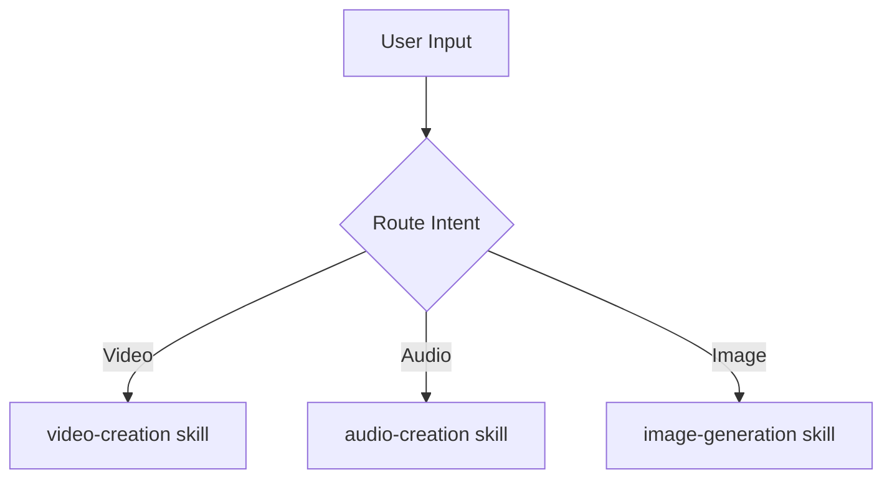

# Diagrams, Infographics & Data Visuals

> **Tool not chosen yet?** Go back to the `media-content-creation` skill — it will invoke
> `find-ai-tools` to search for current free options and let the user pick.
> This file is a workflow guide for *after* a tool has been selected.

## Napkin.ai — Visuals from Text Prompts

Napkin.ai generates clean professional diagrams, flowcharts, and conceptual graphics directly
from text or concept descriptions. No design skills needed.

- URL: napkin.ai
- Input: paste text, describe a concept, or write a prompt
- Output: SVG/PNG diagram, ready to use
- Best for: presentations, documentation, concept visualization, social content
- Free tier: available

**Workflow:**
1. Go to napkin.ai
2. Paste your text or type a description
3. Napkin generates multiple visual interpretations
4. Choose one, customize colors/style, export

**Example prompts:**
- "The lifecycle of a TikTok ad campaign"
- "How neural networks learn"
- "Steps to launch an ecommerce store"

## Mermaid — Code-Based Diagrams

Claude can generate Mermaid diagrams as code, which render in many tools (GitHub, Notion, etc.)

Ask Claude: "Create a Mermaid diagram showing X" — Claude generates the code.
Render it at: mermaid.live

## Excalidraw — Collaborative Whiteboard Diagrams

- URL: excalidraw.com
- Freehand, hand-drawn aesthetic
- Export as SVG or PNG
- Can be embedded in docs/Notion

## Canva — Infographics & Social Graphics

- URL: canva.com
- Free tier very capable
- Templates for Instagram posts, LinkedIn infographics, presentations
- Good for: polish + export in multiple formats
