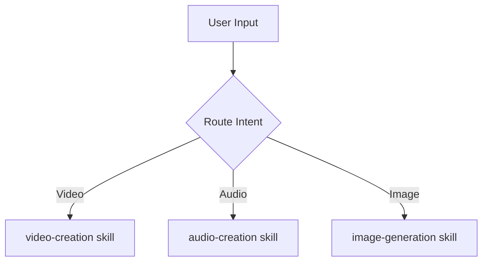

# Diagrams, Infographics & Data Visuals

> **Tool not chosen yet?** Go back to the `media-content-creation` skill — it will invoke
> `find-ai-tools` to search for current free options and let the user pick.
> This file is a workflow guide for *after* a tool has been selected.

## Napkin.ai — Visuals from Text Prompts

Napkin.ai generates clean professional diagrams, flowcharts, and conceptual graphics directly
from text or concept descriptions. No design skills needed.

- URL: napkin.ai
- Input: paste text, describe a concept, or write a prompt
- Output: SVG/PNG diagram, ready to use
- Best for: presentations, documentation, concept visualization, social content
- Free tier: available

**Workflow:**
1. Go to napkin.ai
2. Paste your text or type a description
3. Napkin generates multiple visual interpretations
4. Choose one, customize colors/style, export

**Example prompts:**
- "The lifecycle of a TikTok ad campaign"
- "How neural networks learn"
- "Steps to launch an ecommerce store"

**2026 updates:** Napkin shipped 50+ new visual designs plus faster, more accurate generation; a beta **sketch-to-diagram** feature now refines rough hand-drawn shapes/layouts into polished visuals; in-editor **effects and styling options** add visual depth without restructuring the diagram; expanded icon library with improved icon-matching; and slide-generation + custom branding kits for consistent, on-brand output across a deck.

## Mermaid — Code-Based Diagrams

Claude can generate Mermaid diagrams as code, which render in many tools (GitHub, Notion, etc.)

```mermaid
flowchart TD
    A[User Input] --> B{Route Intent}
    B -->|Video| C[video-creation skill]
    B -->|Audio| D[audio-creation skill]
    B -->|Image| E[image-generation skill]
```

Ask Claude: "Create a Mermaid diagram showing X" — Claude generates the code.
Render it at: mermaid.live

## Excalidraw — Collaborative Whiteboard Diagrams

- URL: excalidraw.com
- Freehand, hand-drawn aesthetic
- Export as SVG or PNG
- Can be embedded in docs/Notion
- **2026 update:** new **Autoshape** tool (Shift+X) converts freehand sketches into clean geometric shapes and arrows on the fly; Excalidraw+ (paid) added expanded cloud storage, voice hangouts/screensharing for live collaboration, an Education plan, multi-language support, and API key management

## Canva — Infographics & Social Graphics

- URL: canva.com
- Templates for Instagram posts, LinkedIn infographics, presentations
- Good for: polish + export in multiple formats
- **Free tier (2026):** permanently free plan now includes ~50 Magic Studio AI uses/month (Text-to-Image, Magic Write, Background Remover) — still capable for light use, but heavier AI workflows need a paid plan
- **Pricing (2026):** Canva Pro is now $18/mo (up from $12.99 in 2025, via a $15 intermediate step); Canva Business is $25/user/mo (replaced the old flat-rate Teams plan)
- **Canva AI 2.0** (Apr 2026) added a proprietary design-layout foundation model plus OpenAI's GPT Image 2 integration for more photorealistic Magic Media output; Magic Studio credits are now a single tiered pool (Standard/Premium/Ultra) instead of one flat 500-credit allowance
