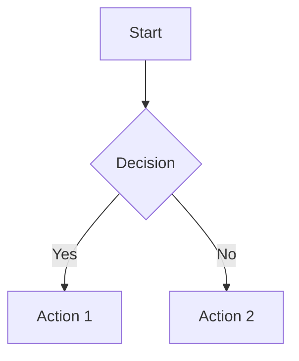

# Data Visualization & Spreadsheets

## Quick Tools

### Charts & Dashboards
**Plotly** (Python, free)
```python
pip install plotly pandas
import plotly.express as px
df = px.data.gapminder()
fig = px.scatter(df, x="gdpPercap", y="lifeExp", color="continent", size="pop")
fig.show()
fig.write_html("chart.html")
```

**Recharts** (React, free)
```bash
npm install recharts
```
```jsx
import { LineChart, Line, XAxis, YAxis } from 'recharts';
const data = [{ name: 'Jan', value: 400 }, { name: 'Feb', value: 300 }];
<LineChart data={data}><Line dataKey="value" /></LineChart>
```

**Chart.js** (JavaScript, free)
```html
<canvas id="myChart"></canvas>
<script src="https://cdn.jsdelivr.net/npm/chart.js"></script>
<script>
new Chart(document.getElementById('myChart'), {
  type: 'bar',
  data: { labels: ['Jan', 'Feb'], datasets: [{ data: [400, 300] }] }
});
</script>
```

### Diagrams (no-code)
**Napkin.ai** — text → diagram (flowcharts, org charts, mind maps)
- URL: napkin.ai
- Free to start
- Best for: quick visual summaries of text

**Mermaid** (code → diagram, free)


Render: mermaid.live or embed in Markdown

### Google Sheets / Excel Formulas
Common formulas:
```
=VLOOKUP(A2, Sheet2!A:B, 2, FALSE)   # lookup value
=SUMIF(A:A, "criteria", B:B)         # conditional sum
=COUNTIFS(A:A, ">100", B:B, "active") # multiple conditions
=IMPORTJSON("https://api.example.com/data") # fetch live data (Sheets)
=ARRAYFORMULA(A1:A10 * B1:B10)       # apply to range
```

### AI-Powered Dashboards
**Streamlit** (Python, free)
```bash
pip install streamlit
streamlit run app.py
```
```python
import streamlit as st
import pandas as pd
import plotly.express as px

st.title("Dashboard")
df = pd.read_csv("data.csv")
fig = px.line(df, x="date", y="value")
st.plotly_chart(fig)
```

**Metabase** (self-hosted, free open-source)
- docker run -d -p 3000:3000 metabase/metabase
- Connect to PostgreSQL, MySQL, CSV
- No-code dashboards with filters

## Recommended Workflow

1. Identify the question the chart should answer
2. Choose chart type: bar (compare), line (trend), scatter (correlation), pie (proportion)
3. Prepare clean data (CSV or DataFrame)
4. Generate with Plotly or Chart.js
5. Export as PNG or embed as interactive HTML
